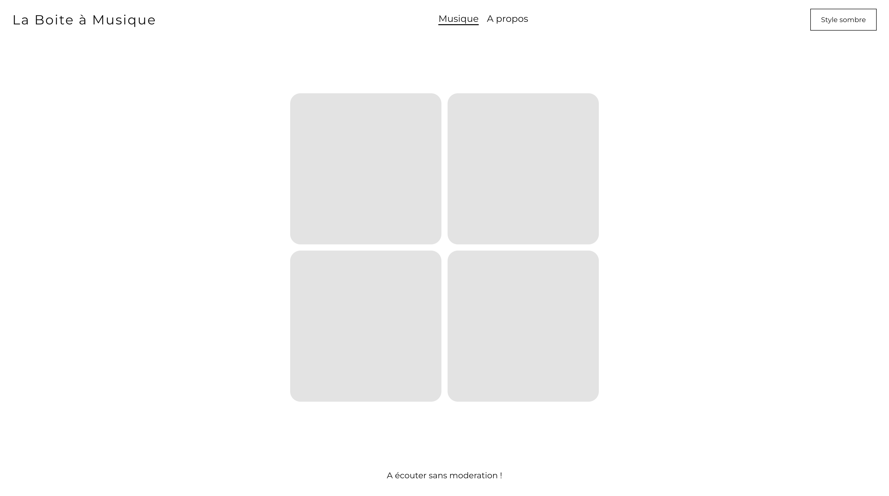
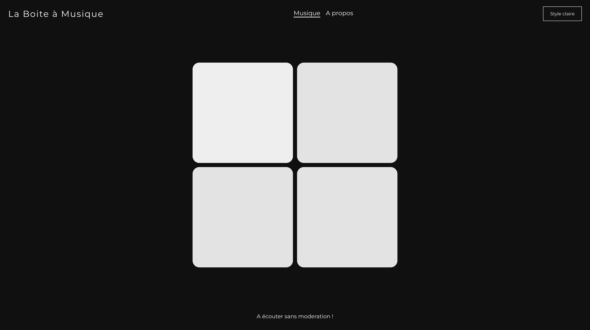

# Boîte à musique en React.js - Projet Etudiant

---

## Contexte

Ce projet a été réalisé dans le cadre d'un projet étudiant en développement web. 
L'objectif était de créer une application de boîte à musique interactive utilisant React.js.

---

## But du projet

L'application a été conçue pour permettre à l'utilisateur d'interagir avec une table de sample. Lorsque l'utilisateur clique sur une touche, il déclenche la lecture de la note associée. 
Le projet fournit également un thème dynamique qui s'adapte à l'heure de la journée.

---

## Technologies utilisées

Le projet utilise les technologies suivantes :

- **React.js**
- **Tone.js**
- **Styled Components** (Une bibliothèque de component)

## Illustrations de l'application

